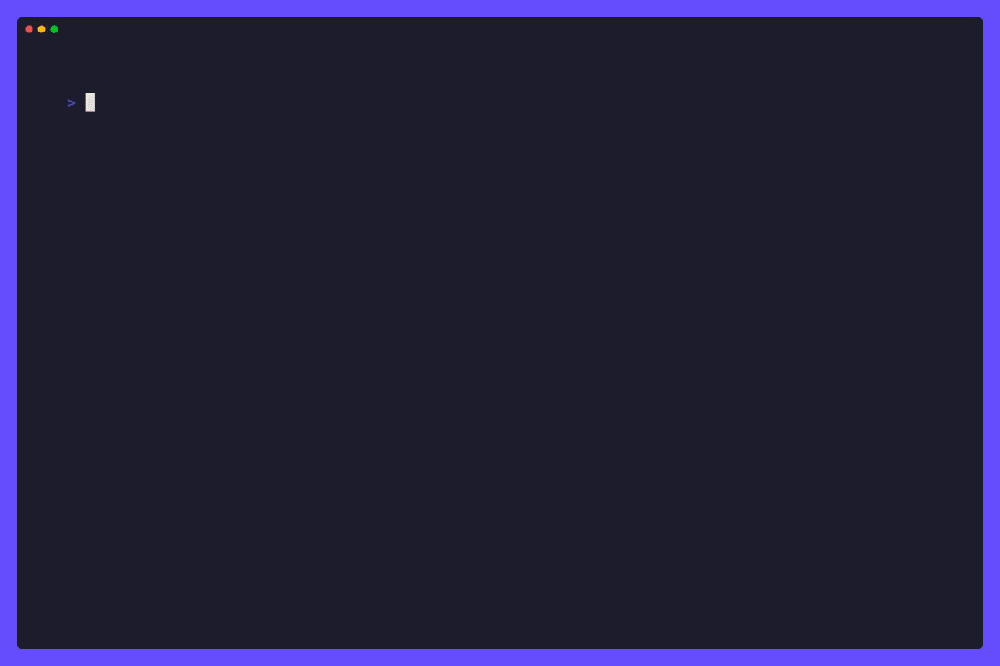

# 🤖 Gollama: Ollama in your terminal, Your Offline AI Copilot 🦙

Gollama is a delightful tool that brings Ollama, your offline conversational AI companion, directly into your terminal. It provides a fun and interactive way to generate responses from various models without needing internet connectivity. Whether you're brainstorming ideas, exploring creative writing, or just looking for inspiration, Gollama is here to assist you.

## 🌟 Features

- **Interactive Interface**: Enjoy a seamless user experience with intuitive interface powered by [Bubble Tea](https://github.com/charmbracelet/bubbletea).
- **Customizable Prompts**: Tailor your prompts to get precisely the responses you need.
- **Multiple Models**: Choose from a variety of models to generate responses that suit your requirements.
- **Visual Feedback**: Stay engaged with visual cues like spinners and formatted output.

## 🚀 Getting Started

### Prerequisites

- [Ollama](https://ollama.com/) installed on your system.

### Installation

1. Clone the repository:

   ```bash
   git clone https://github.com/Gaurav-Gosain/gollama.git
   ```

2. Navigate to the project directory:

   ```bash
   cd gollama
   ```

3. Build the executable:

   ```bash
   go build
   ```

### Usage

1. Run the executable:

   ```bash
   ./gollama
   ```

2. Follow the on-screen instructions to interact with Gollama.

### Options

- `--prompt`: Specify a custom prompt for generating responses.
- `--model`: Choose a specific model for response generation.
- `--piped`: Enable piped mode for automated usage.
- `--raw`: Enable raw output mode for unformatted responses.

## 📖 Examples

### Interactive Mode



### Piped Mode

> [!NOTE]
> Piping into gollama isn't implemented yet.

```bash
echo "Once upon a time" | ./gollama --model="llama2" --prompt="prompt goes here" --piped
```

```bash
./gollama --model="llama2" --prompt="prompt goes here"
```

## 📦 Dependencies

Gollama relies on the following third-party packages:

- [bubbletea](https://github.com/charmbracelet/bubbletea): A library for building terminal applications using the Model-Update-View pattern.
- [glamour](https://github.com/charmbracelet/glamour): A markdown rendering library for the terminal.
- [huh](https://github.com/charmbracelet/huh): A library for building terminal-based forms and surveys.
- [lipgloss](https://github.com/charmbracelet/lipgloss): A library for styling text output in the terminal.

## 🗺️ Roadmap

- [ ] Implement piped mode for automated usage.
- [ ] Add support for downloading models directly from Ollama using the rest API.
- [x] Add support for extracting codeblocks from the generated responses.
- [x] Add ability to copy responses/codeblocks to clipboard.

## 🤝 Contribution

Contributions are welcome! Whether you want to add new features, fix bugs, or improve documentation, feel free to open a pull request.

## Star History

[](https://star-history.com/#Gaurav-Gosain/gollama&Date)

<div style="display:flex;flex-wrap:wrap;">
  
  
  
  
  
  
  
  
  
  
<div>

## 📜 License

This project is licensed under the MIT License - see the [LICENSE](LICENSE) file for details.
