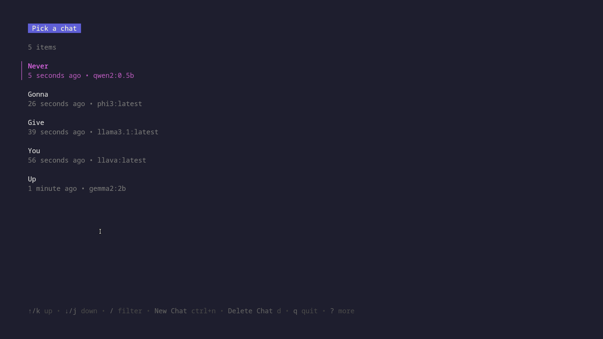
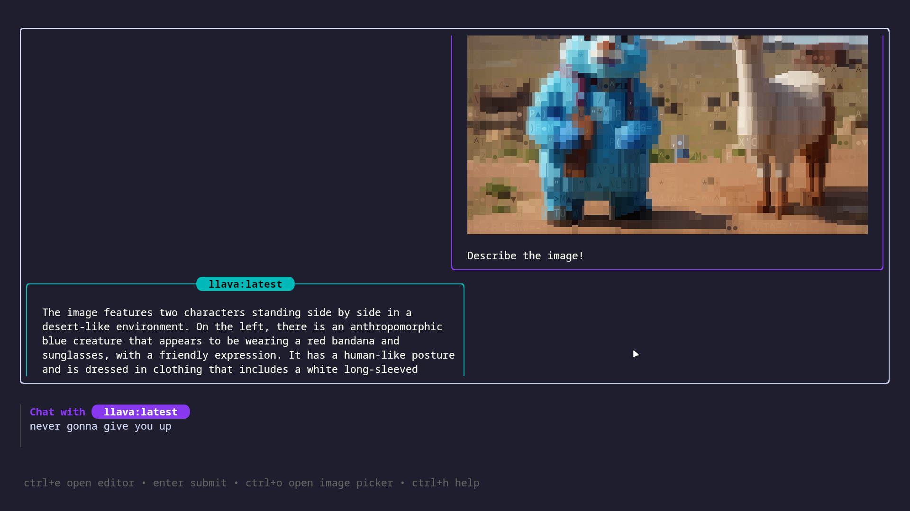
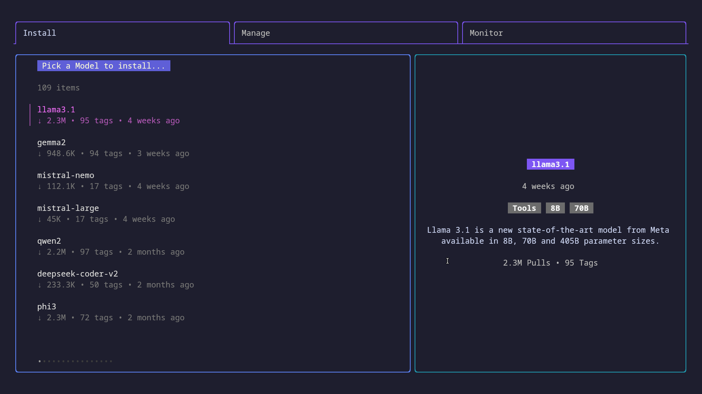

# 🤖 Gollama: Ollama in your terminal, Your Offline AI Copilot 🦙


<!--toc:start-->

- [🤖 Gollama: Ollama in your terminal, Your Offline AI Copilot 🦙](#🤖-gollama-ollama-in-your-terminal-your-offline-ai-copilot-🦙)
  - [Features](#features)
  - [Getting Started](#getting-started)
    - [Prerequisites](#prerequisites)
    - [Installation](#installation)
      - [Download the latest release](#download-the-latest-release)
      - [Install using Go](#install-using-go)
      - [Run using Docker](#run-using-docker)
    - [Usage](#usage)
    - [Options](#options)
      - [TUI Specific Flags](#tui-specific-flags)
      - [CLI Specific Flags](#cli-specific-flags)
  - [Keymaps](#keymaps)
    - [`Pick a chat` screen](#pick-a-chat-screen)
    - [Main Chat Screen](#main-chat-screen)
    - [Modal management screens](#modal-management-screens)
  - [Examples](#examples)
    - [TUI Chat Mode](#tui-chat-mode)
    - [Ollama Model Management](#ollama-model-management)
    - [Piped Mode](#piped-mode)
    - [CLI Mode with Images](#cli-mode-with-images)
  - [Local Development](#local-development)
    - [Run locally using Docker](#run-locally-using-docker)
    - [Build from source](#build-from-source)
  - [Dependencies](#dependencies)
  - [Roadmap](#roadmap)
  - [Contribution](#contribution)
  - [Star History](#star-history)
  - [License](#license)
  <!--toc:end-->

Gollama is a delightful tool that brings [Ollama](https://ollama.com/),
your offline conversational AI companion, directly into your terminal.
It provides a fun and interactive way to generate responses from various models
without needing internet connectivity. Whether you're brainstorming ideas,
exploring creative writing, or just looking for inspiration,
Gollama is here to assist you.


## Features

- **Chat TUI with History**: Gollama now provides a chat-like TUI experience
  with a history of previous conversations. Saves previous
  conversations locally using a SQLite database to continue your conversations later.
- **Interactive Interface**: Enjoy a seamless user experience with
  intuitive interface powered by [Bubble Tea](https://github.com/charmbracelet/bubbletea).
- **Customizable Prompts**: Tailor your prompts to get precisely the responses
  you need.
- **Multiple Models**: Choose from a variety of models to generate responses
  that suit your requirements.
- **Visual Feedback**: Stay engaged with visual cues like spinners and
  formatted output.
- **Multimodal Support**: Gollama now supports multimodal models like Llava
- **Model Installation & Management**: Easily install and manage models using
  the [Ollamanager](https://github.com/gaurav-gosain/ollamanager) library.
  Directly integrated with Gollama, refer the [Ollama Model
  Management](#ollama-model-management) section for more details.

## Getting Started

### Prerequisites

- [Ollama](https://ollama.com/) installed on your system or a gollama API server
  accessible from your machine. (Default: `http://localhost:11434`,
  optionally can be configured using the `OLLAMA_HOST` environment
  variable. Refer the official [Ollama Go SDK docs for further
  information](https://pkg.go.dev/github.com/ollama/ollama/api#ClientFromEnvironment)
- At least one model installed on your Ollama server. You can install models
  using the `ollama pull <model-name>` command.
  To find a list of all available models,
  check the [Ollama Library](https://ollama.com/library/).
  You can also use the `ollama list` command to list all locally installed models.

### Installation

You can install Gollama using one of the following methods:

#### Download the latest release

Grab the latest release from the
[releases page](https://github.com/Gaurav-Gosain/gollama/releases) and extract
the archive to a location of your choice.

#### Install using Go

> [!NOTE]
> Prerequisite: [Go](https://go.dev/) installed on your system.

You can also install Gollama using the `go install` command:

```bash
go install github.com/gaurav-gosain/gollama@latest
```

#### Run using Docker

You can pull the latest docker image from the
[GitHub Docker Container Registry](https://github.com/Gaurav-Gosain/gollama/pkgs/container/gollama)
and run it using the following command:

```bash
docker run --net=host -it --rm ghcr.io/gaurav-gosain/gollama:latest
```

### Usage

1. Run the executable:

   ```bash
   gollama
   ```

   `or`

   ```bash
   /path/to/gollama
   ```

2. Follow the on-screen instructions to interact with Gollama.

> [!NOTE]
> Running Gollama with the `-h` flag will display the list of available flags.

### Options

#### TUI Specific Flags

```sh
  -v, --version Prints the version of Gollama
  -m, --manage  manages the installed Ollama models (update/delete installed models)
  -i, --install installs an Ollama model (download and install a model)
  -r, --monitor Monitor the status of running Ollama models
```

#### CLI Specific Flags

```sh
--model string   Model to use for generation
--prompt string  Prompt to use for generation
--images strings Paths to the image files to attach (png/jpg/jpeg), comma separated
```

---

> [!WARNING]
> The responses for multimodal LLMs are slower than the normal models (also
> depends on the size of the attached image)

## Keymaps

### `Pick a chat` screen

|    Key     | Description          |
| :--------: | -------------------- |
|   `↑/k`    | Up                   |
|   `↓/j`    | Down                 |
| `→/l/pgdn` | Next page            |
| `←/h/pgup` | Previous page        |
|  `g/home`  | Go to start          |
|  `G/end`   | Go to end            |
|  `enter`   | Select chat          |
|    `q`     | Quit                 |
|    `d`     | Delete chat          |
|  `ctrl+n`  | New chat             |
|    `?`     | Toggle extended help |



### Main Chat Screen

|      Key      | Description              |
| :-----------: | ------------------------ |
|  `ctrl+up/k`  | Move view up             |
| `ctrl+down/j` | Move view down           |
|   `ctrl+u`    | Half page up             |
|   `ctrl+d`    | Half page down           |
|   `ctrl+p`    | Previous message         |
|   `ctrl+n`    | Next message             |
|   `ctrl+y`    | Copy last response       |
|    `alt+y`    | Copy highlighted message |
|   `ctrl+o`    | Toggle image picker      |
|   `ctrl+x`    | Remove attachment        |
|   `ctrl+h`    | Toggle help              |
|   `ctrl+c`    | Exit chat                |

> [!NOTE]
> The `ctrl+o` keybinding only works if the selected model is multimodal



### Modal management screens

> [!NOTE]
> The management screens can be chained together.
> For example, using the flags `-imr` will run Ollamanager
> with tabs for installing, managing, and monitoring models.

The following keybindings are common to all modal management screens:

|      Key      | Description                |
| :-----------: | -------------------------- |
|      `?`      | Toggle help menu           |
|     `↑/k`     | Move up                    |
|     `↓/j`     | Move down                  |
|     `←/h`     | Move left                  |
|     `→/l`     | Move right                 |
|    `enter`    | Pick selected item         |
|      `/`      | Filter/fuzzy find items    |
|     `esc`     | Clear filter               |
|  `q/ctrl+c`   | Quit                       |
|    `n/tab`    | Switch to the next tab     |
| `p/shift+tab` | Switch to the previous tab |



> [!NOTE]
> The following keybindings are specific to the `Manage Models` screen/tab:

| Key | Description           |
| --- | --------------------- |
| `u` | Update selected model |
| `d` | Delete selected model |

## Examples

### TUI Chat Mode


### Ollama Model Management

> [!NOTE]
> Gollama uses the [Ollamanager](https://github.com/gaurav-gosain/ollamanager) library to manage models.
> It provides a convenient way to install, update, and delete models.

https://github.com/user-attachments/assets/9e625715-5a8a-4e71-a355-89eaa298eb9b

### Piped Mode

```bash
echo "Once upon a time" | gollama --model="llama3.1" --prompt="prompt goes here"
```

```bash
gollama --model="llama3.1" --prompt="prompt goes here" < input.txt
```

### CLI Mode with Images

> [!IMPORTANT]
> Not supported for all models, check if the model is multimodal

```bash
gollama --model="llava:latest" \
 --prompt="prompt goes here" \
 --images="path/to/image.png"
```

> [!WARNING]
> The `--model` and `--prompt` flags are mandatory for CLI mode.
> The `--images` flag is optional.

## Local Development

### Run locally using Docker

You can also run Gollama locally using docker:

1. Clone the repository:

   ```bash
   git clone https://github.com/Gaurav-Gosain/gollama.git
   ```

2. Navigate to the project directory:

   ```bash
   cd gollama
   ```

3. Build the docker image:

   ```bash
   docker build -t gollama .
   ```

4. Run the docker image:

   ```bash
   docker run --net=host -it gollama
   ```

> [!NOTE]
> The above commands build the docker image with the tag `gollama`.
> You can replace `gollama` with any tag of your choice.

### Build from source

If you prefer to build from source, follow these steps:

1. Clone the repository:

   ```bash
   git clone https://github.com/Gaurav-Gosain/gollama.git
   ```

2. Navigate to the project directory:

   ```bash
   cd gollama
   ```

3. Build the executable:

   ```bash
   go build
   ```

## Dependencies

Gollama relies on the following third-party packages:

- [ollama](https://github.com/ollama/ollama): The official Go SDK for ollama.
- [ollamanager](https://github.com/gaurav-gosain/ollamanager):
  A Go library for installing, managing and monitoring ollama models.
- [bubbletea](https://github.com/charmbracelet/bubbletea):
  A library for building terminal applications using the Model-Update-View pattern.
- [glamour](https://github.com/charmbracelet/glamour):
  A markdown rendering library for the terminal.
- [huh](https://github.com/charmbracelet/huh):
  A library for building terminal-based forms.
- [lipgloss](https://github.com/charmbracelet/lipgloss):
  A library for styling text output in the terminal.

## Roadmap

- [x] Implement piped mode for automated usage.
- [x] Add ability to copy responses to clipboard.
- [x] GitHub Actions for automated releases.
- [x] Add support for downloading models directly from Ollama using the rest API.
- [ ] Add support for extracting and copying codeblocks from the generated responses.
- [ ] Add CLI options to interact with the database and perform operations like:
  - [ ] Deleting chats
  - [ ] Creating a new chat
  - [ ] Listing chats
  - [ ] Continuing a chat from the CLI

## Contribution

Contributions are welcome! Whether you want to add new features,
fix bugs, or improve documentation, feel free to open a pull request.

## Star History

[](https://star-history.com/#Gaurav-Gosain/gollama&Date)

<p style="display:flex;flex-wrap:wrap;">           </p>

## License

This project is licensed under the MIT License -
see the [LICENSE](LICENSE) file for details.
